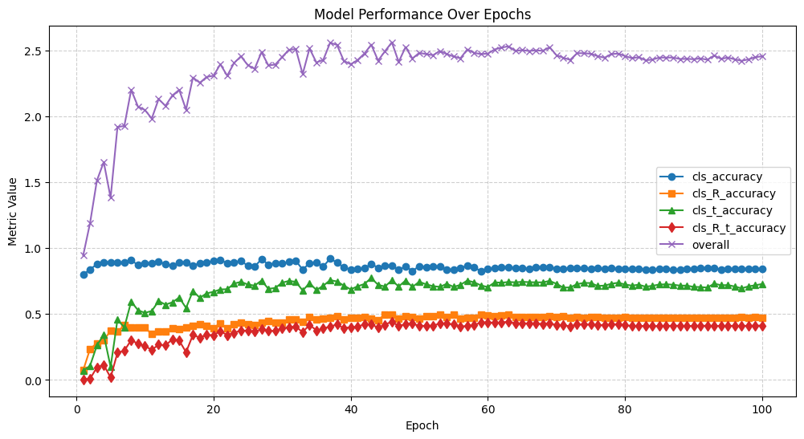

# **6DOF Homework**

**Problem 2**
The experiments I have done and the validation metrics are shown below:
| Experiment                                 | Iteration | cls_accuracy | cls_R_t_accuracy | overall  |
|--------------------------------------------|-----------|--------------|------------------|---------|
| Basic Model                                | 40000     | 0.540578     | 0.046768         | 0.951857 |
| Cropped Images as Input                    | 46000     | 0.865199     | 0.442916         | 2.559835 |
| 6D Rotation Representation & Loss          | 93000     | 0.466300     | 0.027510         | 0.825309 |
| Multiple Heads for Different Object Classes| 47000     | 0.477304     | 0.071527         | 0.944979 |
| Ensemble of All Modifications              | 65000     | 0.723521     | 0.235213         | 1.687758 |

My final model is the Cropped Images as Input one which comprises just the basic model architecture and the default training recipe and hyperparameters. The only modification I made is that I just cropped the input images to their boundng boxes.
| Hyperparameter      | Value                   | Description                                      |
|---------------------|------------------------|--------------------------------------------------|
| `lr`               | 1e-4                    | Learning Rate                                   |
| `weight_decay`     | 1e-4                    | Weight Decay for optimizer                      |
| `output_dir`       | `runs/basic/`           | Output Directory                                |
| `data_dir`         | `data/ycbv/v1/`         | Data Directory                                  |
| `batch_size`       | 16                      | Batch Size                                      |
| `seed`             | 2                       | Random seed                                     |
| `max_iter`        | 100000                   | Total Iterations                                |
| `val_every`        | 1000                    | Iterations interval to validate                 |
| `save_every`       | 50000                   | Iterations interval to save model               |
| `preload_images`   | 1                       | Whether to preload train and val images         |
| `lr_step`          | [60000, 80000]          | Iterations to reduce learning rate              |

The plot validation metrics of my best model is shown below:

