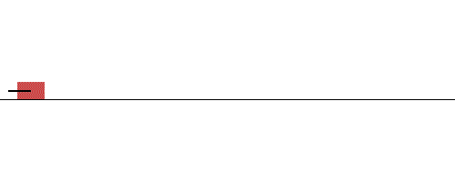

### Linear Quadratic Regulators
The goal of this assignment is to familiarize you with basics of classical
control. You will be deriving the equations for a discrete time linear
quadratic regulator, and using it to solve a linear system, and stabilizing a
non-linear system about a stable fixed point.

1. **Deriving LQR Equations. [1pts]** Consider a linear system with state `x`, and
   controls `u` that evolves as per `x[t+1] = Ax[t] + Bu[t]`. We want to obtain
   control values `u[t]` that optimize the sum over a time horizon of `T`, of
   the following cost function: `x[t]'Qx[t] + u[t]'Ru[t]`. The total cost to go
   when acting optimally at any time-step `t` is a quadratic function of the
   state at that time: `x[t]'P[t]x[t]`. Derive equations that can be used to
   obtain `P[t]`, and the corresponding optimal control `u[t]`. Note, `a'` here
   denotes the transpose of the vector `a`.

2. **Controlling a linear system.** We will now use the equations that you
   derived above to control a linear system. Consider a point mass in 1D, for
   which we can control the acceleration. The state of this system can be
   described by a position `x` and velocity `v`. In discrete time, on
   application of control `u`, the system evolves as follows (for a fixed
   simulation time step `dt`):
   ```
   x[t+1] = x[t] + v[t]*dt
   v[t+1] = v[t] + u[t]*dt
   ```
   2.1 **[1pts]** Write down the `A` and `B` matrices for this linear system.

   2.2 **[7pts - autograded]** We want to control the acceleration for this point mass to
   bring it at rest at the origin. We will do so, by minimizing the sum over
   time of the following cost function: `x[t]^2 + v[t]^2 + u[t]^2`. Solve for a
   controller that brings the point mass to origin, by minimizing this cost
   function. We have provided starter code that implements the environment, you
   need to complete the system (i.e. the A and B matrices from 2.1) and the
   controller (i.e. the classes LQRConrol and LQRSolver) in
   [lqr_solve.py](lqr_solve.py).
      - You can run you controller in this environment by calling `python
        run_classical_control.py --env_name DoubleIntegrator-v1 --num_episodes
        1`.
      - By passing in a `--vis` flag you can visualize what your controller is
        doing: calling `python run_classical_control.py --env_name
        DoubleIntegrator-v1 --num_episodes 1 --vis`. Here is the visualization
        of the controller that I wrote: 
      
      We will measure the average cost incurred by your controller. Upload your
      completed file [lqr_solve.py](lqr_solve.py) to the MP1-code assignment on
      gradescope to have it autograded.  Make sure to include all autograded
      components from all components of MP1 for your final submission.

3. **Stabilizing an inverted pendulum.** Next, we will stabilize a
   non-linear system about an unstable fixed point. We will work with an
   undamped pendulum of unit length, unit mass on a planet with `g=10`.
   Dynamics for a pendulum are governed using the equations
   [here](envs/pendulum.py#L57). Note the choice of the coordinate frame. <br/>
   
   
   Our goal is to stabilize this pendulum in an inverted position (`theta = 0`
   and `theta dot = 0`).  
   We will linearize it about the inverted position, and obtain controllers
   that stabilize this linearized system.

   3.1 **[1pts]** Linearize the system about the point `theta = 0` and `thetadot
   = 0`.  Show your work, and report the linearized system.

   3.2 **[7pts - autograded]** Use the linear-quadratic regulator controller from the
   previous parts, and obtain a controller to stabilize the pendulum. You can
   run the controller in this environment with `python run_classical_control.py
   --env_name PendulumBalance-v1 --num_episodes 1`.  You can also use the
   `--vis` flag as above. Same as for 2.2 above, complete the `PendulumBalance`
   class in file [lqr_solve.py](lqr_solve.py) and upload to GradeScope for
   autograding.  Make sure to include all autograded components from all
   components of MP1 for your final submission.

   3.3 **[3pts]** Next, we will study how robust is your controller to noise in
   the dynamics. We will add zero-mean Gaussian noise (with varying standard
   deviation) to the dynamics updates (see [here](envs/pendulum.py#L69)). We
   will measure the total time spent by the pendulum in the upright position.
   You can invoke this noisy environments using: `python
   run_classical_control.py --env_name PendulumBalance-v1 --num_episodes 100
   --pendulum_noise 0.1`, where `0.1` is the standard deviation of the additive
   Gaussian noise. Plot the average cost, and the average time spent by the
   pendulum in the upright position as a function of the standard deviation of
   the noise for your controller. As above use 100 episodes per standard
   deviation value.  Vary the standard deviation between `0` and `0.1` in steps
   of `0.01`.
   
   3.4 **[Extra Credit 1 pts]** Use your linear controller from above to invert
   a pendulum.  `PendulumInvert-v1` initializes the pendulum at a random angle,
   and you need to apply control to flip it over and keep it upright, and you
   can run it using `python run_classical_control.py --env_name
   PendulumInvert-v1 --num_episodes 1`.  Consider plotting how often this
   linear controller is able to invert the pendulum as a function of the
   starting theta.
