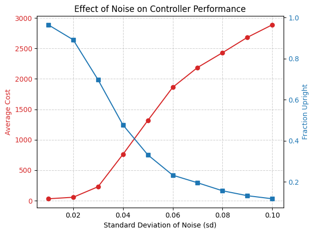
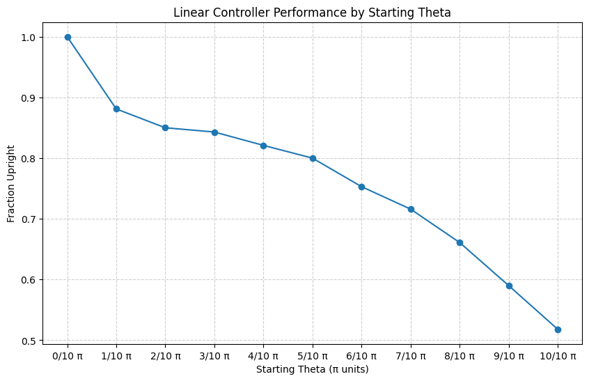

# **LQR Homework**

**Problem 1**
This is how **state** \( x \) and **control** \( u \) evolve according to:

\[ x[t+1] = A x[t] + B u[t] \]

where:
- \( x[t] \in \mathbb{R}^n \) is the state vector.
- \( u[t] \in \mathbb{R}^m \) is the control input.
- \( A \in \mathbb{R}^{n \times n} \) is the state transition matrix.
- \( B \in \mathbb{R}^{n \times m} \) is the control matrix.

We seek to determine the optimal control sequence \( u[t] \) that minimizes the **quadratic cost function** over a finite horizon \( T \):

\[ J = \sum_{t=0}^{T} \left( x[t]^T Q x[t] + u[t]^T R u[t] \right) \]

where:
- \( Q \in \mathbb{R}^{n \times n} \) is the **state cost matrix** (positive semi-definite).
- \( R \in \mathbb{R}^{m \times m} \) is the **control cost matrix** (positive definite).

The **cost-to-go function** at time \( t \), assuming optimal actions are taken thereafter, is a **quadratic function** of the state:

\[ V_t(x) = x[t]^T P[t] x[t]. \]

Then we use **Bellman Equation** to derive the recursive equations to compute \( P[t] \) and obtain the **optimal control law** \( u[t] \).

\[ V_t(x) = \min_{u[t]} \left( x[t]^T Q x[t] + u[t]^T R u[t] + V_{t+1}(x[t+1]) \right). \]

Then we substitute the system dynamics:

\[ x[t+1] = A x[t] + B u[t], \]

we get:

\[ V_t(x) = \min_{u[t]} \Big( x[t]^T Q x[t] + u[t]^T R u[t] + (A x[t] + B u[t])^T P[t+1] (A x[t] + B u[t]) \Big). \]

Expanding the quadratic terms:

\[  V_t(x) = \min_{u[t]} \Big( x[t]^T Q x[t] + u[t]^T R u[t] + x[t]^T A^T P[t+1] A x[t] \]
\[  + u[t]^T B^T P[t+1] B u[t] + 2 x[t]^T A^T P[t+1] B u[t] \Big). \]

Then we differentiate \( V_t(x) \) with respect to \( u[t] \) and set it to zero to find the optimal \( u[t] \):

\[ \frac{d}{du} \left( V_t(x) \right) = 0. \]

\[ (R + B^T P[t+1] B) u + B^T P[t+1] A x = 0. \]

Solving for \( u^* \):

\[ u^* = - (R + B^T P[t+1] B)^{-1} B^T P[t+1] A x. \]

Thus, the **optimal control law** is:

\[ u[t] = -K[t] x[t], \]

where the **LQR feedback gain matrix** is:

\[ K[t] = (R + B^T P[t+1] B)^{-1} B^T P[t+1] A. \]

Then we substitute \( u^* \) into the value function:

\[ V_t(x) = x^T Q x + (-K x)^T R (-K x) + x^T A^T P[t+1] A x \]
\[ + 2 x^T A^T P[t+1] B (-K x) + (-K x)^T B^T P[t+1] B (-K x). \]

We get:

\[ V_t(x) = x^T (Q + A^T P[t+1] A - A^T P[t+1] B K - K^T B^T P[t+1] A + K^T B^T P[t+1] B K + K^T R K) x. \]

The equation simplifies to:

\[ P[t] = Q + A^T P[t+1] A - A^T P[t+1] B (R + B^T P[t+1] B)^{-1} B^T P[t+1] A. \]

This is **Riccati Equation**. As you can see we can solve backward using the terminal condition below via dynamic programming:

\[ P[T] = Q. \]

**Problem 2.1**

\[
    A = \begin{bmatrix} 1 & dt \\\\ 0 & 1 \end{bmatrix},
    B = \begin{bmatrix} 0 \\\\ dt \end{bmatrix}.
\]

**Problem 3.1**

The following are the parameters of the **undamped pendulum**:
- **Unit length** \( l = 1 \)
- **Unit mass** \( m = 1 \)
- **Gravity** \( g = -10 \)
- **Control input** \( u \) (torque applied at the pivot)

The system evolves as:

\[{\theta}_{t+1} = {\theta}_t + \dot\theta_t dt, \]

\[ \dot\theta_{t+1} = \dot\theta_t + (-\frac{3g}{2l} \sin{\theta_t} + \frac{3}{m l^2} u) dt. \]

Substituting \( g = 10, l = 1, m = 1 \), we get:

\[ \dot\theta_{t+1} = \dot\theta_t + (15 \sin{\theta_t} + 3u) dt. \]

Then we linearize the system around **\( \theta_t = 0 \), \( \dot\theta_t = 0 \)**

To linearize, we approximate \( \sin{\theta_t} \) using a **Taylor series expansion** around \( \theta_t = 0 \):

\[ \sin{\theta_t} = \theta_t - \frac{\theta_t^3}{3!} + \mathcal{O}(\theta_t^5). \]

For small angles, the higher-order terms \( \frac{\theta_t^3}{3!} \) and beyond become negligible, leading to the approximation:

\[ \sin{\theta_t} \approx \theta_t. \]

Thus, the second equation simplifies to:

\[ \dot\theta_{t+1} = \dot\theta_t + (15 \theta_t + 3u) dt. \]

Rewriting the system in **state-space form**:

\[\
    \begin{bmatrix} {\theta}_{t+1} \\ \dot\theta_{t+1} \end{bmatrix} =
    \begin{bmatrix} 0 & 1 \\ 15 & 0 \end{bmatrix}
    \begin{bmatrix} \theta_t \\ \dot\theta_t \end{bmatrix} +
    \begin{bmatrix} 0 \\ 3 \end{bmatrix} u.
\]

Thus, the **discrete-time linearized system matrices** then are:

\[\
    A = \begin{bmatrix} 1 & dt \\ 15dt & 1 \end{bmatrix}, \quad
    B = \begin{bmatrix} 0 \\ 3dt \end{bmatrix}.
\]

The **Cost Matrices** are:

\[
    Q = \begin{bmatrix} 1 & 0 \\ 0 & 1 \end{bmatrix}, \quad
    R = \begin{bmatrix} 1 \end{bmatrix}.
\]

**Problem 3.3**

**Problem 3.4**
