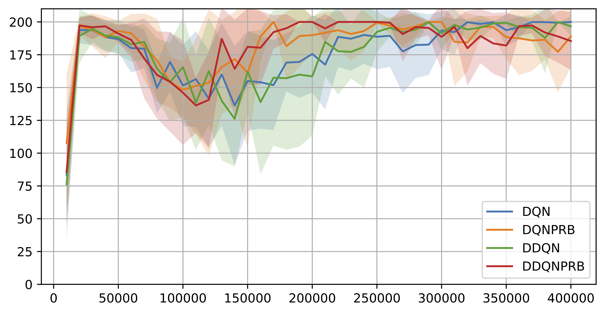
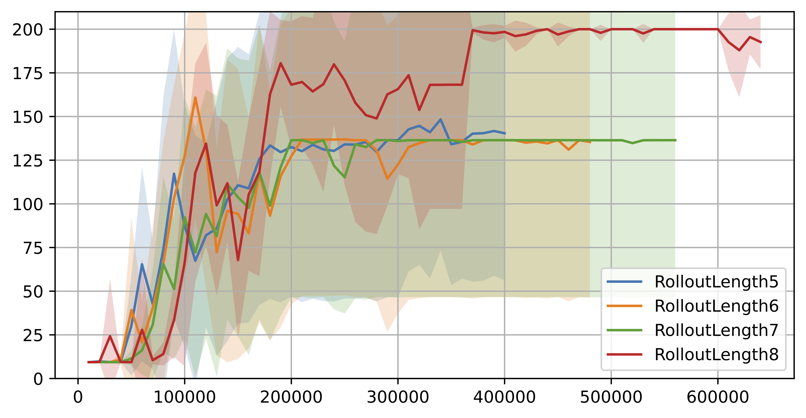
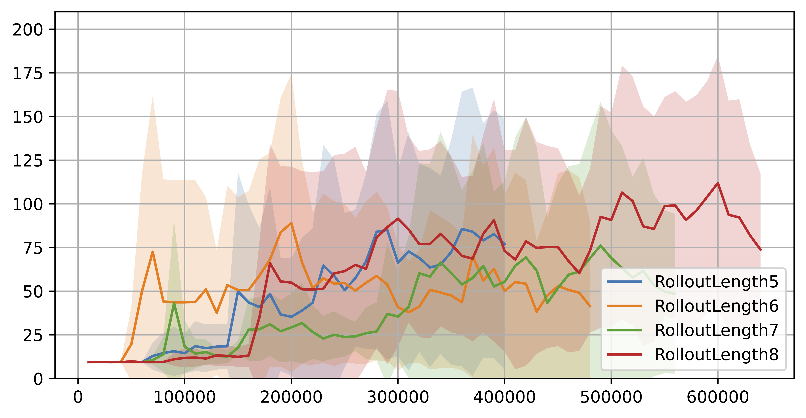

# **MP2 Report**

**Problem 1**
I have implemented the DQN, Double DQN, Prioritized Replay, and Ensemble (DDQN + Prioritized Replay Buffer) methods. I have included the priority replay buffer because it could replay more often the transitions with higher expected learning progress, inidated by TD error. This seems reasonable. I also integrated the Double DQN because it could reduce the over-estimation bias in Q-learning by decoupling the selection and evaluation of the bootstrapped actions.

Finally, I have tested them on the first 6 seeds.

As you can see, the Double DQN with Prioritized Replay Buffer does perform better than others, espeically after 150000 samples. And the DQN with Prioritized Replay Buffer also performs better than the basic DQN and Double DQN. It indicates that the Prioritized Replay Buffer was effective; Double DQN seemed not that effective, maybe because the task and environment were simple and the over-estimation bias was not that large.

**Problem 2**
I have implemented Actor-Critic with state dependent baseline (A2C), Actor-Critic without state dependent baseline and varied the number of rollouts. The reason I varied the length of rollouts is that I found the training loss was quickly to decline to near 0, while the validation mean rewards were still very low and stuck, so I thought it might be due to the policy was overfitting to the training data. Therefore, I thought it might be a good idea to vary the rollout length to see if the policy could generalize better.

<b>Actor-Critic with state dependent baseline (A2C)</b>

<b>Actor-Critic without state dependent baseline</b>

As you can see, Actor-Critic with state dependent baseline (A2C) has much more stable validation performance than Actor-Critic without state dependent baseline.

Also, the Actor-Critic with state dependent baseline (A2C) has much higher validation performance than the Actor-Critic without state dependent baseline overall.

Importantly, increaseing the rollout length could help policy to better generalize to validation data. But it seems working better for the Actor-Critic with state dependent baseline (A2C). As you can see, the validation performance of A2C for the first 6 seeds all reached 200 at the rollout length of 8, while the validation performance of the Actor-Critic without state dependent baseline for the first 6 seeds were still very low and no big improvement even with the increase of rollout length.